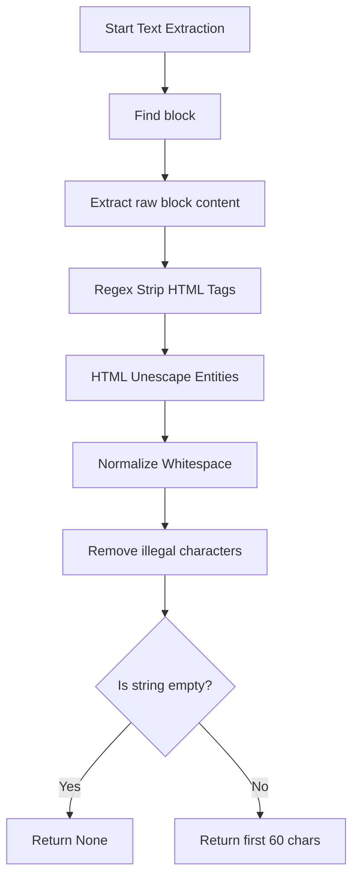
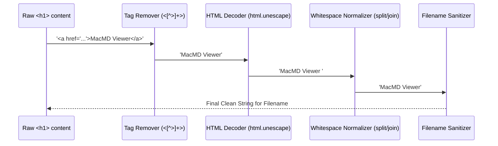
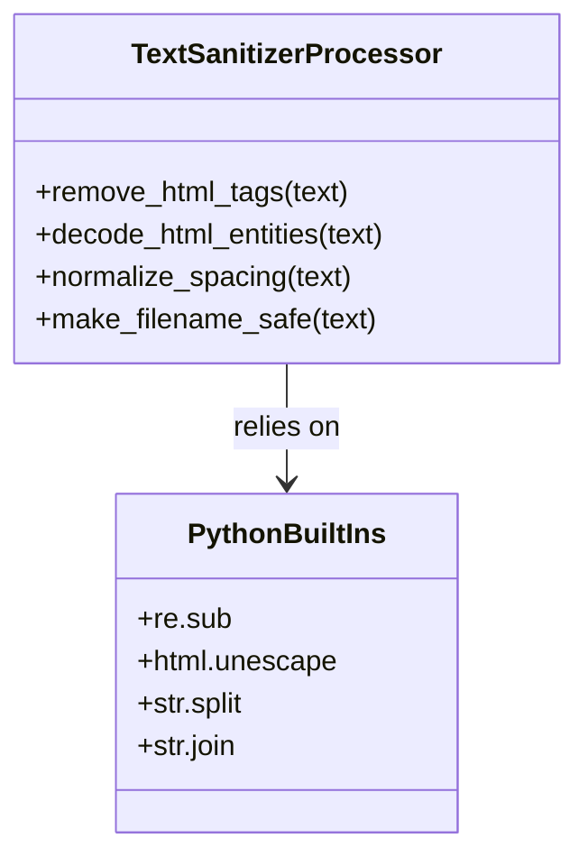
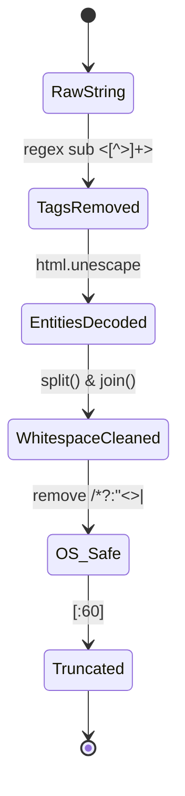
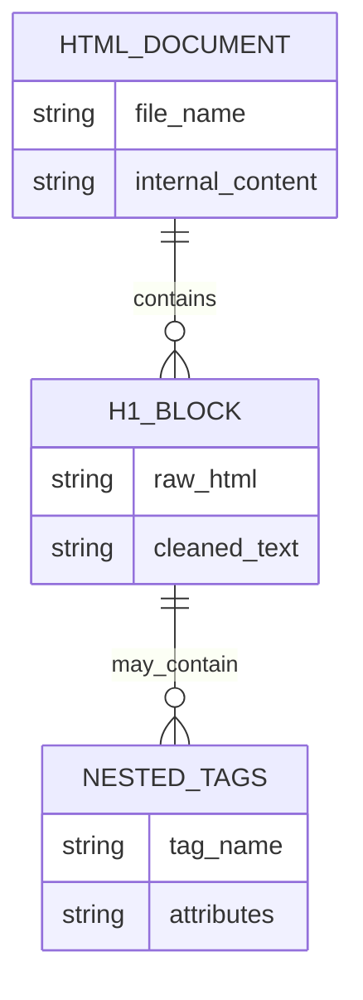
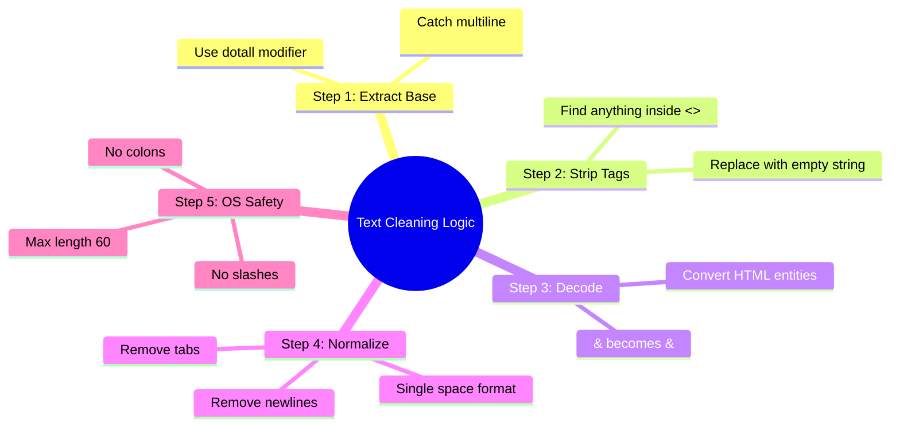

# این فایلها رو بررسی کن و ببین چرا درست و مرتب نامگذاری نشدند و کد اصلاح شده کامل رو بده

عنوان: آموزش استخراج عنوان‌های تو در تو در HTML (رفع مشکل تگ‌های درون <h1>)

سلام! فایل‌های شما را بررسی کردم. دلیل این نام‌گذاری‌های عجیب کاملاً مشخص شد. در دنیای وب، برنامه‌نویسان گاهی درون تگ‌های اصلی، تگ‌های دیگری قرار می‌دهند تا ظاهر صفحه را زیباتر کنند یا لینک بسازند.

**مشکل چیست؟**

```
در فایل‌های شما، عنوان اصلی مستقیماً داخل تگ `<h1>` نوشته نشده است، بلکه یک لینک `<a>` درون تگ `<h1>` قرار دارد. کد قبلی ما هر چیزی که بین `<h1>` و `</h1>` بود (از جمله تگ‌های `<a>` و آدرس‌های اینترنتی داخل آن‌ها) را با چشم بسته برمی‌داشت و نام فایل می‌کرد. به همین دلیل نام فایل‌های شما شامل چیزهایی مثل `a-href-httpsmacked.app...` شده است!
```

بیایید مفاهیم جدید را مرور کنیم:

```
- **Nested Tags (تگ‌های تو در تو):** در HTML، قرار گرفتن یک تگ درون تگ دیگر را تو در تو می‌گویند. (مثل: `<h1> <a>عنوان</a> </h1>`)
```

- **Regex Substitution (re.sub):** جایگزینی در عبارات باقاعده. ما قبلاً از این برای حذف کاراکترهای غیرمجاز استفاده کردیم، الان یاد می‌گیریم چطور از آن برای "پاک‌سازی تگ‌های اضافی" (حذف تمام کدهای HTML درون متن) استفاده کنیم.
- **HTML Entities (موجودیت‌های HTML):** کاراکترهای خاصی که در وب با فرمت خاصی نوشته می‌شوند (مثل `&amp;` به جای `&` یا `&nbsp;` به جای فاصله).

***

### Overall Logic, Technique, and Main Method

```
**Goal (هدف):** استخراج متنِ خالص از داخل تگ `<h1>`، حتی اگر درون آن ده‌ها تگ دیگر (مثل `<a>`, `<span>`, `<strong>`) یا کدهای اضافی HTML وجود داشته باشد.
```

**Technique (تکنیک):**
وقتی با `re.search` محتوای درون `<h1>` را پیدا کردیم، قبل از اینکه آن را به نام فایل تبدیل کنیم، یک مرحله "تصفیه" (Sanitization) به آن اضافه می‌کنیم.

1. با استفاده از دستور `re.sub(r'<[^>]+>', '', text)` به پایتون می‌گوییم: "هر چیزی که شبیه تگ است (یعنی با `<` شروع و با `>` تمام می‌شود) را پیدا کن و حذف کن". این کار باعث می‌شود تمام تگ‌های تو در تو مثل `<a>` کاملاً پاک شوند و فقط متن خالص باقی بماند.
2. با کتابخانه داخلی `html` تمام کدهای مخفی وب (مثل `&nbsp;` یا `&amp;`) را به متن واقعی (فاصله یا `&`) تبدیل می‌کنیم تا نام فایل تمیز باشد.

***

### کدهای برنامه (The Complete Code)

لطفاً کد زیر را جایگزین کنید. بخش جدیدِ پاک‌سازی در تابع `extract_first_heading_from_html` اضافه شده است.

```python
# ENGLISH COMMENT EXPLAINING THE ENTIRE CODE:
# This updated script handles messy, nested HTML tags inside the <h1> tag.
# Instead of blindly taking everything inside <h1>, it first extracts the block,
# then strips away any inner HTML tags (like <a> or <span>) using regex substitution.
# It also decodes HTML entities (like &amp; or &#39;) into normal text characters.
# Finally, it sanitizes the string for macOS file naming rules and limits the length.

import os
import re
import html # New standard library module to clean up HTML entities
from AppKit import NSOpenPanel, NSApplication, NSApp

def open_mac_folder_selector():
    app = NSApplication.sharedApplication()
    app.setActivationPolicy_(0)
    app.activateIgnoringOtherApps_(True)
    
    dialog_panel = NSOpenPanel.openPanel()
    dialog_panel.setCanChooseFiles_(False)
    dialog_panel.setCanChooseDirectories_(True)
    dialog_panel.setAllowsMultipleSelection_(False)
    
    if dialog_panel.runModal() == 1:
        return dialog_panel.URLs()[^0].path()
    return None

def extract_first_heading_from_html(file_path):
    with open(file_path, 'r', encoding='utf-8') as html_file:
        file_content = html_file.read()
        
        # Step 1: Find the <h1> block
        search_result = re.search(r'<h1[^>]*>(.*?)</h1>', file_content, re.IGNORECASE | re.DOTALL)
        
        if search_result:
            # Get whatever is inside the <h1> block (including other tags like <a>)
            raw_heading = search_result.group(1)
            
            # Step 2: Remove all internal HTML tags using Regex
            # r'<[^>]+>' means "find anything that starts with '<', has chars other than '>', and ends with '>'"
            text_without_tags = re.sub(r'<[^>]+>', '', raw_heading)
            
            # Step 3: Decode HTML entities (e.g., changes "&amp;" to "&")
            decoded_text = html.unescape(text_without_tags)
            
            # Step 4: Clean up white spaces and new lines
            # Replace multiple spaces/newlines with a single space, then strip edges
            clean_text = " ".join(decoded_text.split())
            
            # Step 5: Remove characters that macOS does not allow in file names
            safe_filename = re.sub(r'[\\/*?:"<>|]', "", clean_text)
            
            # If the resulting string is empty after cleaning, return None
            if not safe_filename:
                return None
                
            return safe_filename[:60]
            
    return None

def rename_html_files_in_selected_folder():
    folder_path = open_mac_folder_selector()
    
    if not folder_path:
        print("No folder was selected. Exiting program.")
        return
        
    print(f"Searching in folder: {folder_path}")
    
    for filename in os.listdir(folder_path):
        if filename.endswith(".html"):
            old_full_path = os.path.join(folder_path, filename)
            extracted_title = extract_first_heading_from_html(old_full_path)
            
            if extracted_title:
                new_filename = f"{extracted_title}.html"
                new_full_path = os.path.join(folder_path, new_filename)
                
                # Check if the exact filename is already exactly the same (to avoid re-renaming)
                if filename == new_filename:
                    print(f"INFO: File '{filename}' already has the correct name. Skipping.")
                    continue
                
                # Make sure the new name doesn't conflict with another existing file
                if not os.path.exists(new_full_path):
                    os.rename(old_full_path, new_full_path)
                    print(f"SUCCESS: Renamed '{filename}' to '{new_filename}'")
                else:
                    print(f"WARNING: File '{new_filename}' already exists. Cannot rename '{filename}'.")
            else:
                print(f"INFO: No valid text found in <h1> for '{filename}'. Skipping.")

if __name__ == "__main__":
    rename_html_files_in_selected_folder()
```


***

### آموزش خط به خط تغییرات (قدم به قدم)

بیایید دقیقاً ببینیم در تابع `extract_first_heading_from_html` چه اتفاقی می‌افتد که مشکل فایل‌های شما حل شد:

- `import html`: یک کتابخانه استانداردِ پایتون است. ما از آن برای ترجمه کدهای وب به زبان انسان استفاده می‌کنیم (مثلاً `&quot;` را به `"` تبدیل می‌کند).

```
- `raw_heading = search_result.group(1)`: در فایل‌های شما، این بخش یک چیز کثیف برمی‌گرداند؛ مثلاً: ` <a href="link">MacMD Viewer</a> `.
```

```
- `re.sub(r'<[^>]+>', '', raw_heading)`: این مهم‌ترین خطِ جدیدِ ماست. می‌گوید: "هر جا علامت `<` دیدی، تا رسیدن به علامت `>` تمام محتوا را پاک کن." با این کار، تگ‌های `<a>` و `</a>` کاملاً پودر می‌شوند و فقط متن خالص "MacMD Viewer" باقی می‌ماند.
```

- `html.unescape(text_without_tags)`: گاهی در متن‌ها به جای فاصله از `&nbsp;` استفاده می‌شود. این خط تمام این کدهای زشت را به فاصله‌های واقعی تبدیل می‌کند.
- `" ".join(decoded_text.split())`: گاهی بین کلمات اینتر (Enter) یا فاصله‌های زیادی وجود دارد. این تکنیک (ابتدا خرد کردن با split و سپس چسباندن با یک فاصله) تمام فاصله‌های اضافی و خطوط جدید را به یک فاصله تمیز و یکدست تبدیل می‌کند.
- `if filename == new_filename: continue`: در تابع اصلی، یک شرط اضافه کردیم که اگر فایل از قبل نامش دقیقاً همان نام جدیدِ پیشنهادی بود، برنامه الکی تلاش نکند آن را تغییر نام دهد (تا پردازش سریع‌تر شود). کلمه `continue` به حلقه می‌گوید: "از این فایل عبور کن و برو سراغ فایل بعدی."

***

### نمودارهای طراحی سیستم (Mermaid Diagrams)

در اینجا جریان پردازش و تصفیه متن (Sanitization) به تصویر کشیده شده است.














***

### نتیجه‌گیری و تحلیل (Summary)

ما مشکل کثیف بودن داده‌ها (Data Cleansing) را حل کردیم. یاد گرفتیم که در دنیای واقعی، داده‌هایی که از وب می‌گیریم همیشه تمیز نیستند و تگ‌های تو در تو دارند. با ساخت یک "زنجیره پردازش و تصفیه متن" (پیدا کردن الگوها، حذف تگ‌ها، ترجمه موجودیت‌ها، و در نهایت حذف کاراکترهای غیرمجاز سیستم‌عامل)، توانستیم به عنوانِ تمیز و خالص برسیم.

**پیشنهادات کاربردی (Practical Suggestions):**

- هرگاه خواستید اطلاعاتی را از صفحات وب استخراج کنید (Web Scraping)، همیشه فرض را بر این بگذارید که طراح سایت، درون تگ‌های اصلی، تگ‌های دیگری برای لینک‌سازی یا رنگ‌بندی قرار داده است.
- اگر این فایل‌هایی که برای من فرستادید (مثل `a-href-httpsmacked...`) از قبل در پوشه شما تغییر نام داده شده‌اند و نام‌هایشان خراب است، ابتدا آن‌ها را پاک کنید و فایل‌های اصلی (و دست نخورده) را در پوشه قرار دهید، سپس کد جدید را اجرا کنید.

**ایده‌های قدم بعدی و نقشه راه (Roadmap):**

1. **قدم اول:** پوشه تست خود را مرتب کرده (فایل‌های خراب قبلی را حذف و فایل‌های اصلی را قرار دهید).
2. **قدم دوم:** این کد جدید را اجرا کنید و از تمیز بودن نام فایل‌های جدید لذت ببرید.
3. **قدم سوم:** یادگیری کار با پوشه‌های تو در تو. چطور با استفاده از `os.walk` به جای `os.listdir`، برنامه را طوری بنویسیم که تمام فایل‌های HTML را حتی اگر در صدها پوشه مختلف درون هم قرار دارند، پیدا کرده و تغییر نام دهد.

آیا فایل‌ها این بار با نامِ کاملاً تمیز و مرتب ذخیره شدند؟
<span style="display:none">[^1][^2][^3]</span>

<div align="center">⁂</div>

[^1]: a-href-httpsmacked.appmacmd-viewer-mac-crack.htmlMacMD-Viewe-2.html

[^2]: f97f8ff8-a28f-44cd-a0b5-02b1a44d5768.html

[^3]: a-href-httpsmacked.appmarkchart-mermaid-editor-mac-crack.htm-3.html

